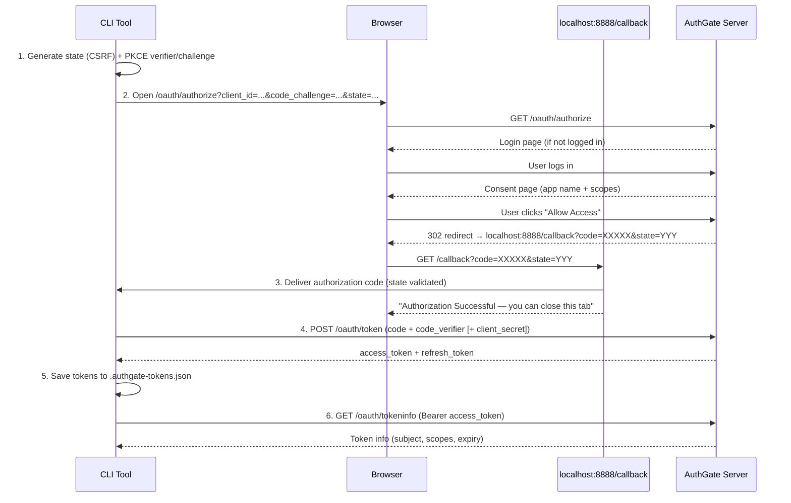

# AuthGate OAuth CLI — Authorization Code Flow

[](https://github.com/go-authgate/oauth-cli/actions/workflows/testing.yml)
[](https://github.com/go-authgate/oauth-cli/actions/workflows/security.yml)

A command-line tool that demonstrates the **OAuth 2.0 Authorization Code Flow** (RFC 6749 §4.1) with **PKCE** (RFC 7636) against an AuthGate server.

Unlike the Device Code Flow (which shows a user code to enter manually), this flow opens a browser window and receives the authorization code via a local HTTP callback server.

## Which Client Mode Should I Use?

| Scenario                  | Mode                    | `CLIENT_SECRET` |
| ------------------------- | ----------------------- | --------------- |
| SPA, mobile app, CLI tool | **Public + PKCE**       | Leave empty     |
| Server-side web app       | **Confidential + PKCE** | Set the secret  |

## Quick Start

### 1. Register an OAuth Client in AuthGate

Navigate to **Admin → OAuth Clients → Create New Client** and configure:

- **Grant Types**: Authorization Code Flow (RFC 6749)
- **Client Type**: `Public` (no secret) or `Confidential`
- **Redirect URIs**: `http://localhost:8888/callback`

### 2. Configure

```bash
cp .env.example .env
# Edit .env with your CLIENT_ID (and CLIENT_SECRET for confidential clients)
```

### 3. Run

```bash
go run .
# or build first:
go build -o authgate-oauth-cli && ./authgate-oauth-cli
```

The tool will:

1. Open your browser at the AuthGate authorization page
2. After you log in and approve access, the browser redirects to `localhost:8888/callback`
3. The CLI receives the authorization code, exchanges it for tokens, and saves them locally
4. On subsequent runs the saved tokens are reused (or refreshed automatically)

## Configuration

All settings can be provided as flags, environment variables, or in a `.env` file (flag > env > default).

| Flag             | Environment Variable | Default                          | Description                                  |
| ---------------- | -------------------- | -------------------------------- | -------------------------------------------- |
| `-client-id`     | `CLIENT_ID`          | _(required)_                     | OAuth client ID (UUID)                       |
| `-client-secret` | `CLIENT_SECRET`      | `""`                             | Client secret — omit for public/PKCE clients |
| `-server-url`    | `SERVER_URL`         | `http://localhost:8080`          | AuthGate server URL                          |
| `-redirect-uri`  | `REDIRECT_URI`       | `http://localhost:8888/callback` | Callback URI (must be registered)            |
| `-port`          | `CALLBACK_PORT`      | `8888`                           | Local port for the callback server           |
| `-scope`         | `SCOPE`              | `read write`                     | Space-separated OAuth scopes                 |
| `-token-file`    | `TOKEN_FILE`         | `.authgate-tokens.json`          | Token storage file path                      |

### Examples

```bash
# Public client (PKCE, no secret)
go run . -client-id=550e8400-e29b-41d4-a716-446655440000

# Confidential client (with secret)
go run . -client-id=550e8400-... -client-secret=your-secret

# Custom server and port
go run . -client-id=550e8400-... \
         -server-url=https://auth.example.com \
         -port=9000 \
         -redirect-uri=http://localhost:9000/callback
```

## How It Works



### PKCE (always enabled)

PKCE (Proof Key for Code Exchange) is used for all clients — including confidential ones — for defence in depth. The CLI generates a fresh `code_verifier` and `code_challenge` on every authorization attempt.

### Token Lifecycle

- **Reuse**: Valid tokens are loaded from disk and used immediately.
- **Refresh**: Expired access tokens are refreshed silently using the stored refresh token.
- **Re-auth**: If the refresh token is also expired or invalid, the full Authorization Code Flow restarts.

## Token Storage

Tokens are saved to `.authgate-tokens.json` (configurable). The file supports multiple client IDs:

```json
{
  "tokens": {
    "550e8400-e29b-41d4-a716-446655440000": {
      "access_token": "eyJ...",
      "refresh_token": "eyJ...",
      "token_type": "Bearer",
      "expires_at": "2026-02-19T12:00:00Z",
      "client_id": "550e8400-e29b-41d4-a716-446655440000"
    }
  }
}
```

The file is written with `0600` permissions and uses atomic rename to prevent corruption.

## Security Notes

- **PKCE** prevents authorization code interception attacks (RFC 7636).
- **State** parameter prevents CSRF attacks; the callback server validates it.
- **TLS 1.2+** is enforced for all HTTPS connections.
- **HTTP warning** is printed when the server URL uses plain HTTP.
- Add `.authgate-tokens.json` to `.gitignore`.

## Troubleshooting

**`CLIENT_ID not set`** — Provide the client ID via flag, env var, or `.env` file.

**`failed to start callback server on port 8888`** — Another process is using that port. Change it with `-port=9000` and update your registered Redirect URI accordingly.

**`access_denied`** — The user clicked **Deny** on the consent page. Run again to retry.

**`invalid_grant`** — The authorization code was already used or expired. Run again to get a new code.

**Token verification failed** — The token may have been revoked. Delete `.authgate-tokens.json` and re-authenticate.

## Learn More

- [RFC 6749 — The OAuth 2.0 Authorization Framework](https://datatracker.ietf.org/doc/html/rfc6749)
- [RFC 7636 — Proof Key for Code Exchange (PKCE)](https://datatracker.ietf.org/doc/html/rfc7636)
- [AuthGate Authorization Code Flow Guide](../../docs/AUTHORIZATION_CODE_FLOW.md)
