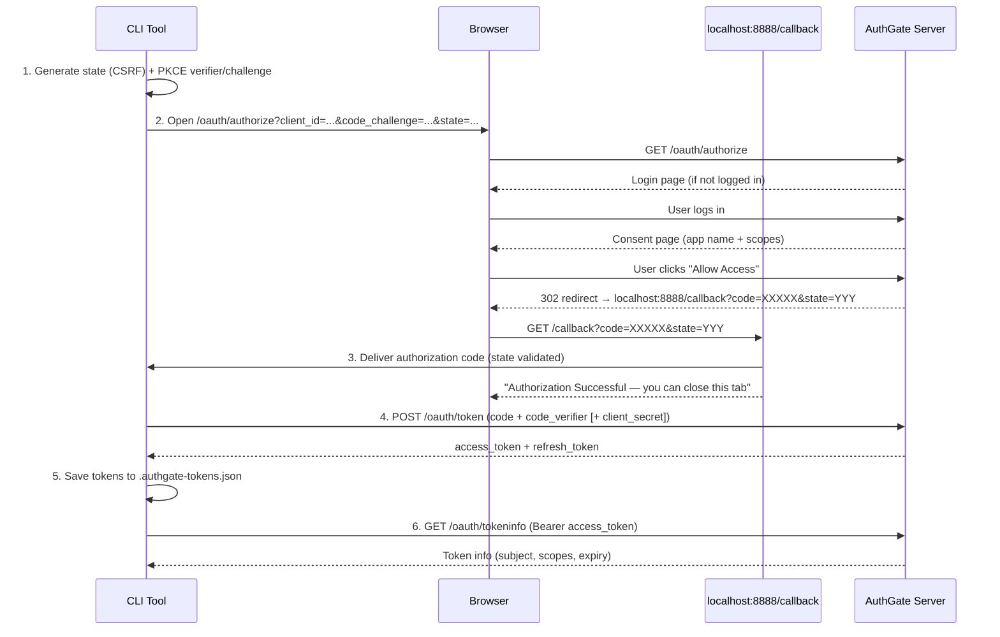

# AuthGate OAuth CLI — Authorization Code Flow

[](https://github.com/go-authgate/oauth-cli/actions/workflows/testing.yml)
[](https://github.com/go-authgate/oauth-cli/actions/workflows/security.yml)

A CLI tool that authenticates with an AuthGate server by opening your browser, then manages OAuth 2.0 tokens locally — no manual code copying required.

**What it does:**

- Opens your browser at the AuthGate authorization page automatically
- Spins up a local HTTP server to receive the OAuth callback
- Exchanges the authorization code for tokens and saves them to disk
- On subsequent runs, reuses valid tokens or refreshes them silently

**Security defaults:**

- PKCE (RFC 7636) always enabled — for both public and confidential clients
- State parameter validated on every callback to prevent CSRF
- TLS 1.2+ enforced for all HTTPS connections
- Token file written with `0600` permissions and atomic rename

---

## Prerequisites

- **Go 1.24+**
- A running [AuthGate](https://github.com/go-authgate) server
- An OAuth client registered in AuthGate Admin with:
  - Grant type: **Authorization Code**
  - Redirect URI: `http://localhost:8888/callback`

---

## Quick Start

### 1. Register an OAuth Client in AuthGate

Navigate to **Admin → OAuth Clients → Create New Client** and configure:

- **Grant Types**: Authorization Code Flow (RFC 6749)
- **Redirect URIs**: `http://localhost:8888/callback`
- **Client Type**: choose based on your use case:

| Scenario                  | Client Type             | `CLIENT_SECRET` |
| ------------------------- | ----------------------- | --------------- |
| SPA, mobile app, CLI tool | **Public + PKCE**       | Leave empty     |
| Server-side web app       | **Confidential + PKCE** | Set the secret  |

### 2. Configure

```bash
cp .env.example .env
# Edit .env — set at minimum CLIENT_ID
```

`.env.example`:

```ini
# Required
CLIENT_ID=your-client-id-here

# Optional: leave empty for public client (PKCE mode), set for confidential client
CLIENT_SECRET=

# Server configuration
SERVER_URL=http://localhost:8080

# Callback server (must match the Redirect URI registered in AuthGate)
CALLBACK_PORT=8888
REDIRECT_URI=http://localhost:8888/callback

# OAuth scopes (space-separated)
SCOPE=read write

# Token storage
TOKEN_FILE=.authgate-tokens.json
```

### 3. Run

```bash
go run .
# or build first:
go build -o authgate-oauth-cli && ./authgate-oauth-cli
```

---

## Terminal Output

**First run** — browser opens, you log in and approve access:

```
=== OAuth 2.0 Authorization Code Flow CLI Demo ===
Client mode : public (PKCE)
Server URL  : http://localhost:8080
Client ID   : 550e8400-e29b-41d4-a716-446655440000

No existing tokens found, starting Authorization Code Flow...
Step 1: Opening authorization URL in your browser...

  http://localhost:8080/oauth/authorize?client_id=...&code_challenge=...

Browser opened. Please complete authorization in your browser.
Step 2: Waiting for callback on http://localhost:8888/callback ...
Authorization code received!
Step 3: Exchanging authorization code for tokens...
Tokens saved to .authgate-tokens.json

========================================
Current Token Info:
Access Token : eyJ0eXAiOiJKV1QiLCJhbGciOiJSUzI1NiJ9...
Token Type   : Bearer
Expires In   : 59m59s
========================================

Verifying token with server...
Token Info: {"sub":"user@example.com","scope":"read write","exp":1740048000}
Token verified successfully.

Demonstrating automatic refresh on API call...
API call successful!
```

**Subsequent runs** — tokens are reused without opening the browser:

```
=== OAuth 2.0 Authorization Code Flow CLI Demo ===
Client mode : public (PKCE)
Server URL  : http://localhost:8080
Client ID   : 550e8400-e29b-41d4-a716-446655440000

Found existing tokens.
Access token is still valid, using it.
...
```

---

## Configuration

All settings can be provided as flags, environment variables, or in a `.env` file.

**Precedence:** flag > environment variable > default

| Flag             | Environment Variable | Default                          | Description                                  |
| ---------------- | -------------------- | -------------------------------- | -------------------------------------------- |
| `-client-id`     | `CLIENT_ID`          | _(required)_                     | OAuth client ID (UUID)                       |
| `-client-secret` | `CLIENT_SECRET`      | `""`                             | Client secret — omit for public/PKCE clients |
| `-server-url`    | `SERVER_URL`         | `http://localhost:8080`          | AuthGate server URL                          |
| `-redirect-uri`  | `REDIRECT_URI`       | `http://localhost:8888/callback` | Callback URI (must be registered)            |
| `-port`          | `CALLBACK_PORT`      | `8888`                           | Local port for the callback server           |
| `-scope`         | `SCOPE`              | `read write`                     | Space-separated OAuth scopes                 |
| `-token-file`    | `TOKEN_FILE`         | `.authgate-tokens.json`          | Token storage file path                      |

### Examples

```bash
# Public client (PKCE, no secret)
go run . -client-id=550e8400-e29b-41d4-a716-446655440000

# Confidential client (with secret)
go run . -client-id=550e8400-... -client-secret=your-secret

# Custom server and port
go run . -client-id=550e8400-... \
         -server-url=https://auth.example.com \
         -port=9000 \
         -redirect-uri=http://localhost:9000/callback
```

---

## How It Works

The CLI acts as an OAuth 2.0 client: it builds an authorization URL, opens the browser, then waits on a local HTTP server for the callback carrying the authorization code. Once received, it exchanges the code for tokens and saves them locally.



### PKCE (always enabled)

PKCE (Proof Key for Code Exchange) is used for all clients — including confidential ones — for defence in depth. The CLI generates a fresh `code_verifier` and `code_challenge` on every authorization attempt.

---

## Token Lifecycle

On every run the CLI follows this decision tree:

```
Load token from disk
       │
       ├─ Not found ──────────────► Full Authorization Code Flow
       │
       ├─ Found, still valid ─────► Use immediately
       │
       └─ Found, expired
              │
              ├─ Refresh succeeds ► Use refreshed token
              │
              └─ Refresh fails ──► Full Authorization Code Flow
```

- **Reuse**: Valid tokens are loaded from disk and used immediately.
- **Refresh**: Expired access tokens are refreshed silently using the stored refresh token.
- **Re-auth**: If the refresh token is also expired or invalid, the full Authorization Code Flow restarts.

---

## Token Storage

Tokens are saved to `.authgate-tokens.json` (configurable). The file supports multiple client IDs so you can authenticate against several clients without conflicts:

```json
{
  "tokens": {
    "550e8400-e29b-41d4-a716-446655440000": {
      "access_token": "eyJ...",
      "refresh_token": "eyJ...",
      "token_type": "Bearer",
      "expires_at": "2026-02-19T12:00:00Z",
      "client_id": "550e8400-e29b-41d4-a716-446655440000"
    }
  }
}
```

The file is written with `0600` permissions and uses atomic rename to prevent corruption.

> **Tip:** Add `.authgate-tokens.json` to your `.gitignore` to avoid accidentally committing tokens.

---

## Security Notes

| Concern                         | Mitigation                                                  |
| ------------------------------- | ----------------------------------------------------------- |
| Authorization code interception | PKCE (RFC 7636) — `code_verifier` never leaves the client   |
| CSRF on callback                | `state` parameter validated before code is accepted         |
| Token in transit                | TLS 1.2+ enforced for all HTTPS connections                 |
| Accidental plaintext exposure   | Warning printed when `SERVER_URL` uses plain HTTP           |
| Token file permissions          | Written as `0600`; uses atomic rename to prevent corruption |

---

## Troubleshooting

**`CLIENT_ID not set`** — Provide the client ID via flag, env var, or `.env` file.

**`failed to start callback server on port 8888`** — Another process is using that port. Change it with `-port=9000` and update your registered Redirect URI accordingly.

**`access_denied`** — The user clicked **Deny** on the consent page. Run again to retry.

**`invalid_grant`** — The authorization code was already used or expired. Run again to get a new code.

**Token verification failed** — The token may have been revoked. Delete `.authgate-tokens.json` and re-authenticate.

---

## Learn More

- [RFC 6749 — The OAuth 2.0 Authorization Framework](https://datatracker.ietf.org/doc/html/rfc6749)
- [RFC 7636 — Proof Key for Code Exchange (PKCE)](https://datatracker.ietf.org/doc/html/rfc7636)
- [AuthGate Authorization Code Flow Guide](../../docs/AUTHORIZATION_CODE_FLOW.md)
